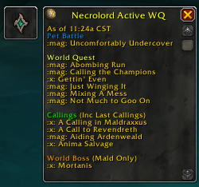
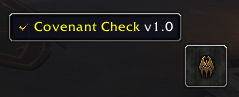

# Covenant Check
'Covenant Check' is a World of Warcraft addon designed to help us check WQ for Necrolord Unity and easier to copy/paste into Discord chat, rather than repetitive typing every day :)  Also for Revendreth, Venthyr, it checks for Mirror (checking Pet Battle) then adds Waypoint to 3 different mirror locations.

There is nothing for Night Fae.  I'm not sure about Kyrian since I do not have a character in that Covenant yet...

## Contribute
Please report bugs on the [Github Issue Reporting] https://github.com/vandiel01/CovenantCheck/issues/new.

The use of [BugGrabber] https://www.curseforge.com/wow/addons/bug-grabber and [BugSack] https://www.curseforge.com/wow/addons/bugsack will help tremendously with the debugging process.

You can also contribute to the addon by [Donate] https://paypal.me/Vandiel01

## Image Samples
###### Necrolord
 
###### Venthyr
 
